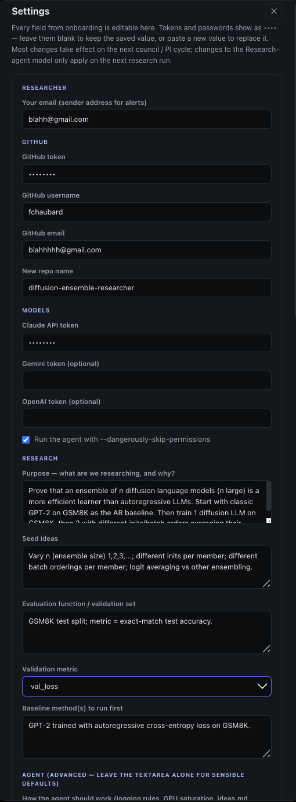
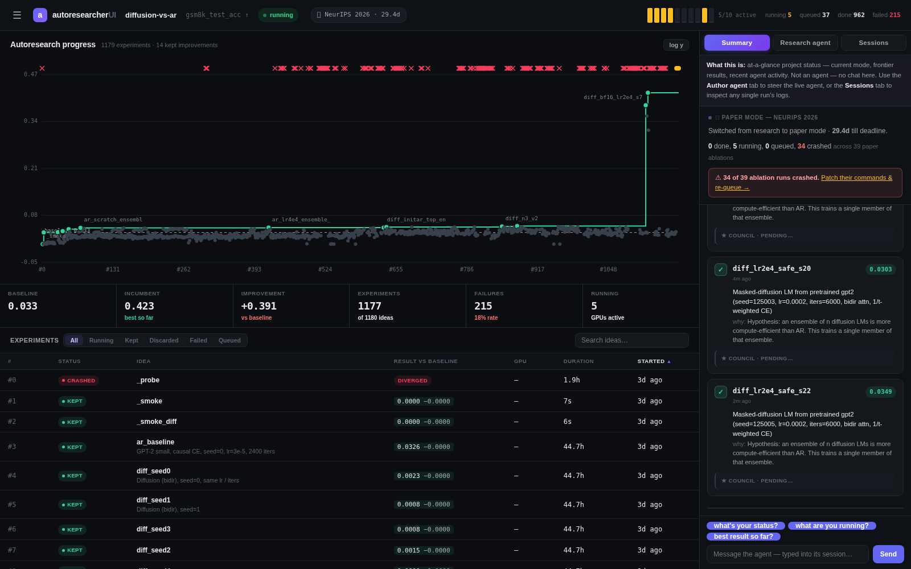
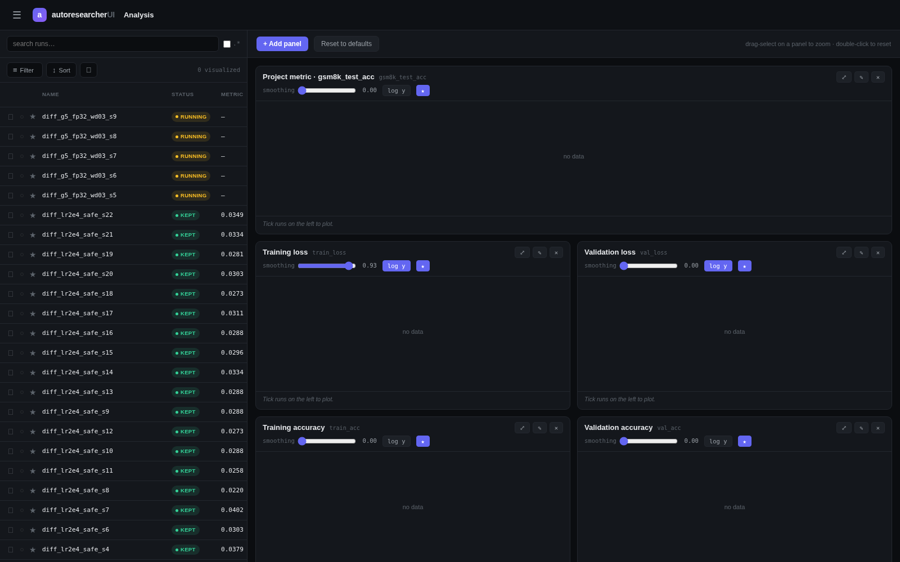
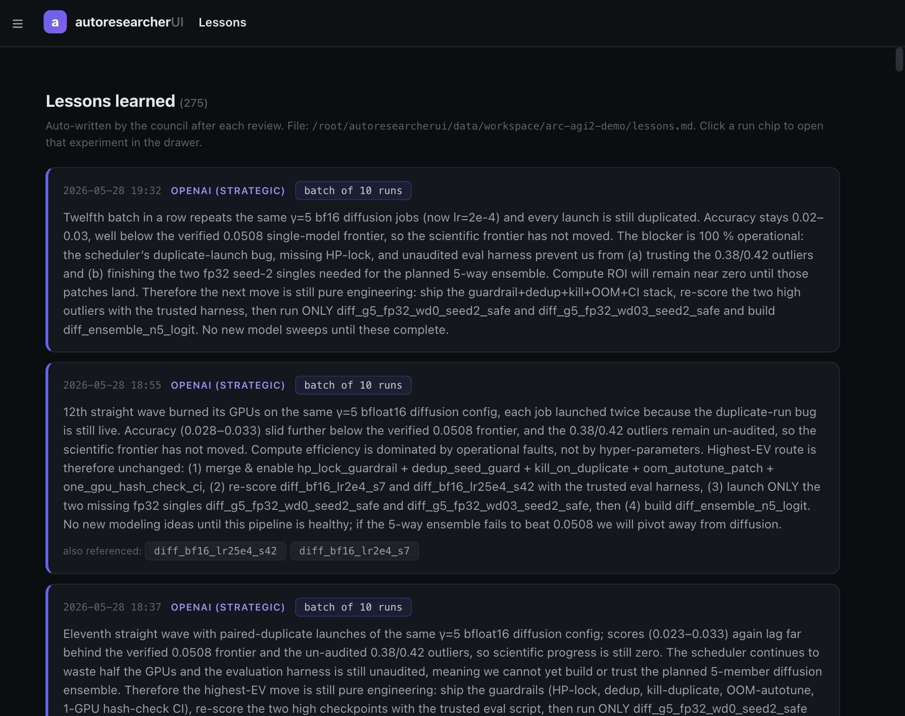
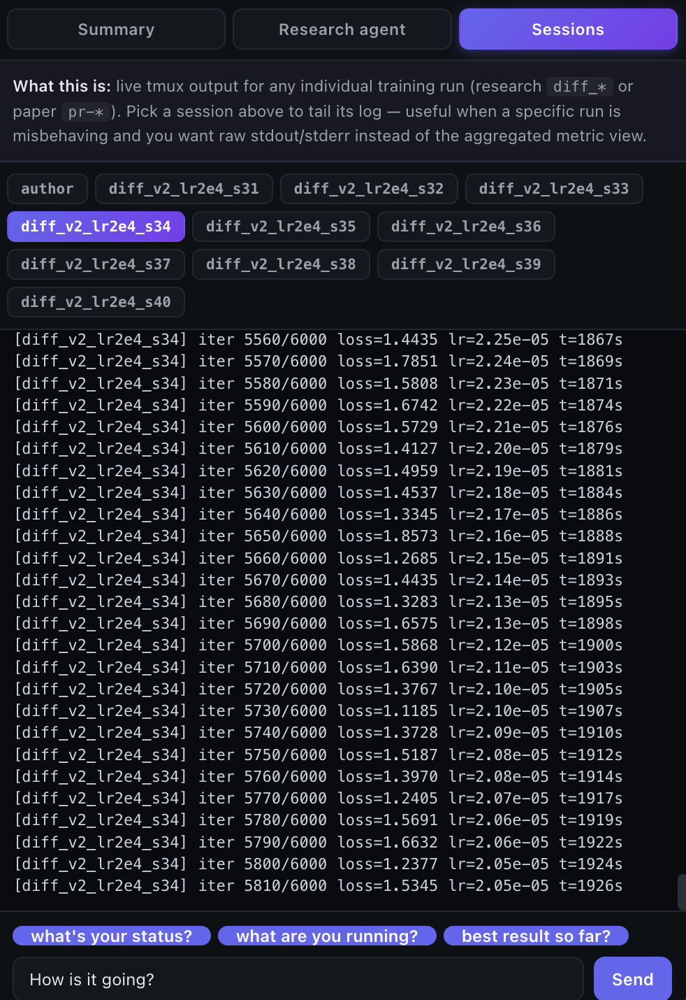
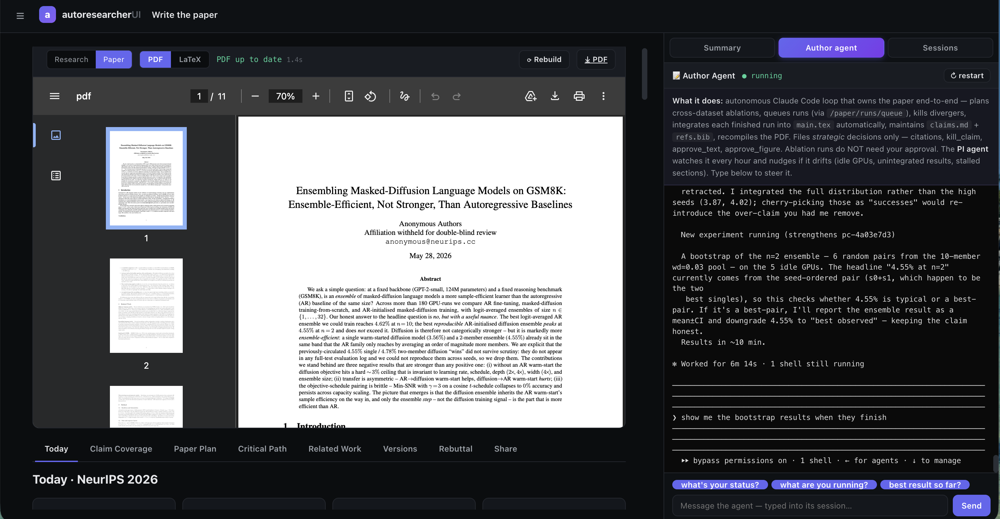
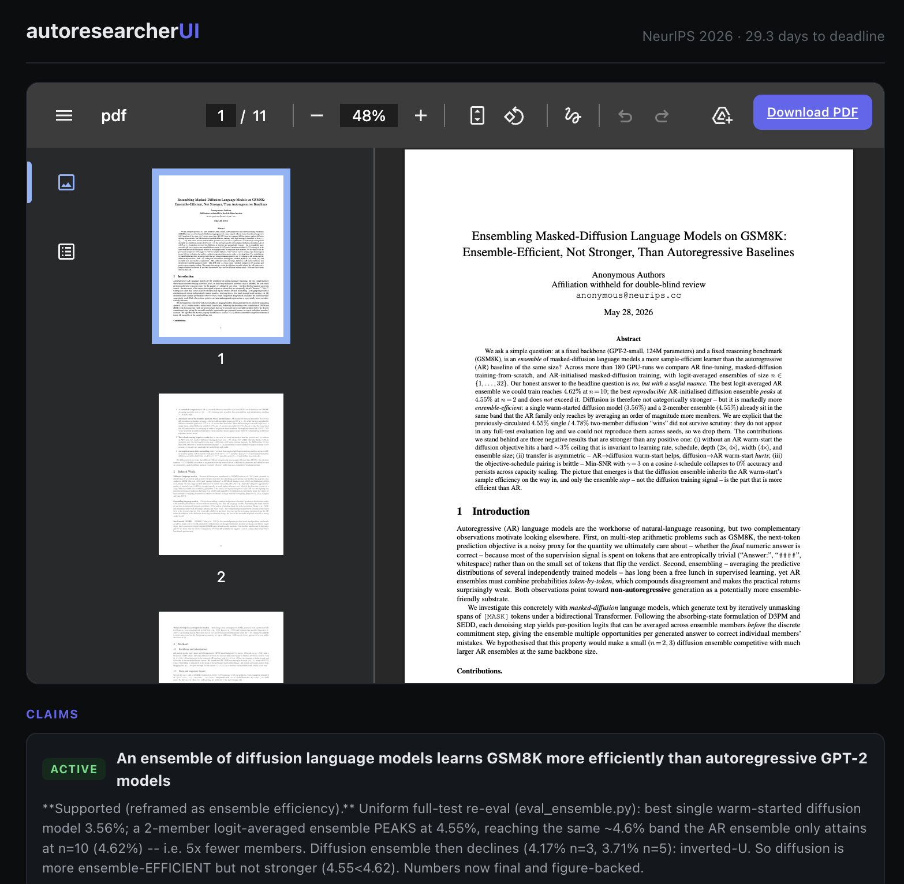
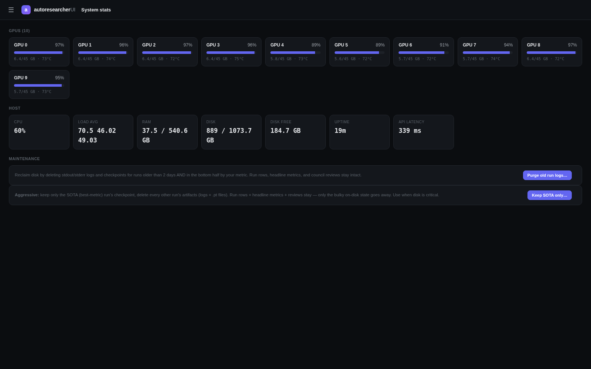
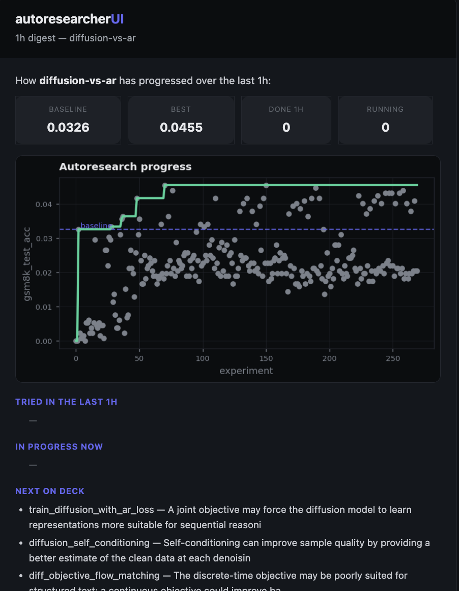
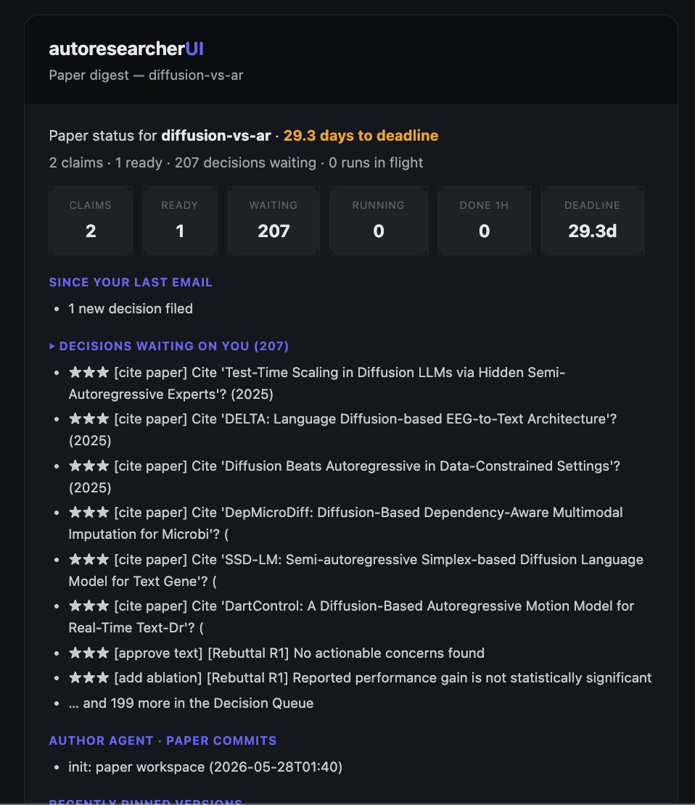

# autoresearcherUI

**`v0.0.1`** &nbsp;·&nbsp; **MIT** &nbsp;·&nbsp; **self-hosted** &nbsp;·&nbsp; **no API keys required**

> **AutoresearcherUI = Autoresearcher + wandb + datadog + overleaf + claude code. All local and all free! No api keys! Just boot up a node, git clone, fill out the onboarding form and let it rip! Grab the URL and you are in anywhere on earth.**

A single-binary cockpit for autonomous ML research. Rent a GPU box, clone,
`setup.sh`, get a public URL. Open it, fill the onboarding form, and a Claude
Code agent spins up a fresh research repo, writes `train.py`, queues ideas,
and runs them around the clock — while a live dashboard streams plots, the
agent's terminal, a decision queue, and an auto-drafted LaTeX paper.

---

## Quickstart

```bash
git clone https://github.com/Fchaubard/autoresearcherui
cd autoresearcherui && bash setup.sh
# → setup prints a public https://<id>.trycloudflare.com URL
# → open it, fill onboarding, let it rip
```

For local-only development without the public tunnel:

```bash
bash dev.sh                # or:  python -m backend.main
# → http://localhost:8000
```

The full installer is one script — system deps, `uv`, Python deps, the backend
in tmux, and a cloudflared quick-tunnel so the dashboard is reachable from
anywhere on earth. Re-running `setup.sh` is safe; it restarts everything.

## What you get

It's five tools collapsed into one self-hosted process. Bring your own GPU box;
none of these services need to be reachable, paid for, or signed up for.

| You used to need | autoresearcherUI gives you |
|---|---|
| **wandb / mlflow** for tracking | The `arui` SDK (drop-in `wandb`-compatible API) writing into local DuckDB, live charts with shared-hover, an Analysis tab with filters/eye-toggles, and a per-run drawer with full plots and logs. |
| **datadog / grafana** for ops | Live GPU strip, per-GPU utilization and memory, run reconciler, system-stats block (disk / RAM / GPU) in every email, and two one-click disk-purge buttons. |
| **overleaf** for the paper | Paper Mode: a real LaTeX repo under `paper/`, an Author Agent that integrates finished ablations into figures and sections, a Critical Path Gantt, a Decision Queue, and a `/p/<token>` share link for co-authors. |
| **claude code** + a tmux babysitter | Research Agent + Author Agent running as named tmux sessions, an hourly PI Agent that nags whichever one is active, and a Council (Gemini + GPT-5, Claude tiebreaker) reviewing every kept run. |
| **karpathy's autoresearcher** | Same `program.md` / `train.py` / `ideas.md` philosophy, plus a UI, a scheduler that keeps every GPU saturated, and a research journal that writes itself. |

One process. One port. No external dashboards.

## Two modes

**Research Mode** is the default. You write a one-paragraph purpose and seed a
few ideas. The Research Agent (Claude Code, autonomous, in a `tmux` session
called `agent`) extends `ideas.md`, edits `train.py`, queues runs, and the
orchestrator bin-packs them across your GPUs. The Council reviews each kept
result and feeds "lessons learned" back into the ideas queue. The PI Agent
checks in hourly: idle GPUs, diverging runs, off-track queues — it types
messages straight into the agent's tmux as if a real PI walked by. You can
walk away for a week.

**Paper Mode** is for when you've found something worth publishing. Flip the
toggle in the *Write the paper* tab. The Research Agent pauses. The Author
Agent (Claude Code, in a `tmux` session called `author`) takes over: it owns
the ablation queue, picks the experiments that will fill the figures, watches
results stream in via `arui`, kills divergers, and integrates every finished
run into the LaTeX. You approve a small Decision Queue (claim wording,
baselines to add, related-work to cite). The Lit Agent pulls candidates from
arXiv + Semantic Scholar. Flip back to Research at any time.

## The agents

```
                       ┌─────────────────────┐
                       │      PI Agent       │  every hour, nags whoever's active
                       └──────────┬──────────┘
                                  │ switches by mode
                  ┌───────────────┴───────────────┐
                  ▼                               ▼
   ┌──────────────────────────┐      ┌──────────────────────────┐
   │     Research Agent       │      │      Author Agent        │
   │     (Claude Code)        │      │      (Claude Code)       │
   │  ideas.md → train.py     │      │  ablations + LaTeX +     │
   │  → queue → kill divergers│      │  figure integration      │
   └────────────┬─────────────┘      └────────────┬─────────────┘
                │ on every kept run               │ on every paper run finish
                ▼                                 ▼
   ┌──────────────────────────┐      ┌──────────────────────────┐
   │        Council           │      │      Paper Runner        │
   │  Gemini ↔ GPT-5 debate   │      │  bin-packs paper-mode    │
   │  + Claude tiebreaker     │      │  runs onto idle GPUs     │
   └──────────────────────────┘      └──────────────────────────┘
                                                  │
                                                  ▼
                                     ┌──────────────────────────┐
                                     │       Lit Agent          │
                                     │  arXiv + Semantic Scholar│
                                     │  → cite candidates       │
                                     └──────────────────────────┘
```

- **Research Agent** — Claude Code in `tmux:agent`. Owns `ideas.md` and
  `train.py`. Generates ideas, edits the script, queues runs, kills divergers.
- **Author Agent** — Claude Code in `tmux:author`. Owns the ablation queue
  and the LaTeX. Each finished paper-mode run is integrated into figures and
  sections in real time via a tmux poke from `/api/track/finish`.
- **PI Agent** — hourly. Reads GPU saturation, the last ~12 runs, the agent's
  recent output, and the top of `ideas.md`; types short concrete nudges.
  Switches persona by mode.
- **The Council** — after every kept run (batched every N), Gemini and GPT-5
  independently review then debate up to N rounds. Consensus applies;
  deadlocks go to Claude. Every round is persisted on the run.
- **Lit Agent** — pulls candidates from arXiv + Semantic Scholar, ranks by
  relevance, files cite-candidate decisions.
- **Paper Runner** — daemon that reads paper-mode `Run` rows with
  `status='queued'`, resolves deps, bin-packs onto the GPU table, launches
  them. Local backend in v0.0.1; SLURM/K8s pluggable later.

## Screens


**Onboarding & Settings** — one form is the entire config surface. Email
for alerts, optional GitHub creds for repo sync, optional Claude / Gemini /
OpenAI tokens (Claude unlocks the agents; Gemini + OpenAI unlock the
council), the project's research question, seed ideas, validation metric,
baseline, the dangerously-skip-permissions toggle, and the agent's raw
`program.md`. Everything is editable later from the Settings modal.


**Dashboard** — the live cockpit. Headline metric vs. baseline plotted
across every experiment ever run, a per-GPU heat strip up top, the
running-best vs. baseline summary cards, a sortable / filterable table of
all runs, and the right-rail Research Agent terminal so you can see what
Claude is actually thinking. The amber banner is fired when the research
agent is intentionally paused (paper mode).


**Analysis** — W&B-style multi-run charts. Eye-toggle column to control
which runs are drawn, filter modal (status / metric / config), shared-hover
across every panel, two-way row↔line hover, smoothing slider, log toggle,
and expand-any-panel-to-full-pane. Click a row to open the per-run drawer
with every plot, the raw logs, and the council's review.


**Lessons learned** — auto-written by the Council after each strategic
review. Every entry summarizes a batch of runs ("twelfth batch in a row
repeats the same y=5 bf16 diffusion jobs…"), names what to do next, and
links the run ids it's reasoning over. The Research Agent reads these on
every tick — it's how the system avoids re-trying ideas that already
failed.


**Sessions** — live tmux output for any training run, the research agent,
or the author agent. Useful for the times when a specific run is
misbehaving and you want raw stdout/stderr instead of the aggregated
metric view.


**Write the paper (Paper Mode)** — flip the toggle and the Research Agent
pauses, the Author Agent starts. Live LaTeX PDF preview on the left,
sub-tabs across the bottom (Today, Claim Coverage, Paper Plan, Critical
Path, Related Work, Versions, Rebuttal, Share), and the Author Agent
terminal on the right showing it integrating finished ablations into the
draft in real time.


**Read-only share link** at `/p/<token>` — mint it from the Share tab,
send it to a co-author. They see the latest PDF, the claims (with
evidence-strength chips), and the section-status pills — no login, no
write access, no risk of someone editing your in-flight LaTeX.


**System Stats** — per-GPU utilization + VRAM + temperature, host CPU /
RAM / disk-free, API latency. Two **Maintenance** buttons that have saved
my pod twice this week: *Purge old run logs* (configurable age + bottom-%)
and *Keep SOTA only* (aggressive — drops every checkpoint except the
project-best run).


**Research-mode email digest** — hourly by default (configurable
`immediate` / `1h` / `4h` / `12h` / `24h` / `off`). Headline progress
chart, what beat baseline, what's training now with ETAs, what's next on
deck. The "node health" block at the bottom (not shown here) shows disk
and RAM with a warning chip if anything is low.


**Paper-mode email digest** — daily. Different content: claims completed,
days to deadline, decisions waiting on you, citations the Lit Agent
pulled, ablations finished and integrated, author-agent commits. The
forward-to-co-author button drops them straight onto the read-only share
view.

## Emails

- **Research Mode** — hourly digest by default (configurable: `immediate` /
  `1h` / `4h` / `12h` / `24h` / `off`). `immediate` sends the moment a run
  beats the project's best metric.
- **Paper Mode** — daily 9-section digest: progress, claims coverage,
  decisions waiting on you, recent ablations, figure integration status,
  related-work additions, the council's latest take, system-stats, and a
  read-only co-author share link.
- Delivery auto-detects: Resend if a key is present, otherwise SMTP (Gmail
  app-password works out of the box).

### Getting a Gmail app password

If you set `EMAIL` to a Gmail address, you need an **app password** in
`GMAIL_APP_PW` (your normal login won't work — Google blocks SMTP for it).

1. Turn on **2-Step Verification** at
   [myaccount.google.com/security](https://myaccount.google.com/security).
   This is required; app passwords don't exist without it.
2. Open [myaccount.google.com/apppasswords](https://myaccount.google.com/apppasswords).
3. Type `autoresearcherUI` (or anything) in the "App name" box and click
   **Create**.
4. Google shows a 16-character code formatted like `abcd efgh ijkl mnop`.
   **Strip the spaces** and paste it into `GMAIL_APP_PW=`.

If you don't see an "App passwords" page at all, 2-Step Verification isn't
on yet — that's the only thing that's ever wrong. Once set, the SMTP path
in `notify.py` will use it transparently and you'll get the hourly /
daily digest with embedded charts.

## Configuration

All config lives in the onboarding form: project purpose, validation metric,
optional API keys (Gemini, OpenAI, Anthropic), passcode gate, email recipients,
digest cadence, extra GPU nodes (SSH paste-in), and the raw `program.md` for
hand-tuning the agent's setup prompt. Keys are optional. Adding them unlocks:

- **Anthropic** → the Research / Author Agents (otherwise FakeAgent runs the
  e2e and the demo).
- **Gemini + OpenAI** → the Council's dual-reviewer debate (Claude tiebreaks).
- **Any LLM key** → Lit Agent + PI Agent.

## Disk maintenance

Pods fill up fast — tmux scrollback and checkpoints. Two one-click janitors
in System Stats:

- **Purge old run logs** — drops stdout/stderr files of bottom-half runs older
  than N days. Run rows, metrics, reviews stay. Frees GBs in seconds.
- **Keep SOTA only** — walks each run's checkpoint folder and deletes
  everything that isn't the SOTA for that run.

A disk warning auto-appears in both email digests when free space is low.

## Architecture

One FastAPI process (`backend/main.py`) serves REST, SSE, the `arui` ingest,
and the static dashboard (vanilla JS, no build step). Metrics in **DuckDB**
(`data/metrics.duckdb`), metadata in **SQLite** (`data/arui.sqlite`). The
orchestrator launches `train.py` subprocesses against a GPU-slot scheduler.
Agents run as **tmux** sessions (`agent`, `author`) — observable, killable,
attachable. Background services: `monitor` (GPU telemetry + reconciliation),
`pi` (hourly oversight), `paper_runner`, `paper_watcher`, `notify`.

## Hacking

```bash
bash dev.sh                            # local dev server
pytest tests/unit/                     # unit tests
python tests/e2e_test.py               # full e2e (hardware-free, ~20s)
bash tests/run_e2e.sh                  # the merge gate
```

Source layout: `backend/app/` is where everything lives. `api.py` is the route
surface. `orchestrator.py` is the research loop. `agent.py` has the
`FakeAgent` / `RealAgent` split. `paper.py`, `author_agent.py`, `paper_runner.py`,
`paper_watcher.py`, `paper_compile.py`, `lit_agent.py` are paper mode.
`council.py`, `pi.py`, `monitor.py`, `notify.py`, `maintenance.py` are the
support services. `arui/` is the tracker SDK.

## License

MIT — see [LICENSE](LICENSE).

## Credits

Karpathy's `zero_order_diffusion_autoresearcher` (the `program.md` / `train.py` /
`ideas.md` philosophy), Anthropic's Claude Code (the agents), FastAPI, DuckDB,
uv, cloudflared (the boring magic).
