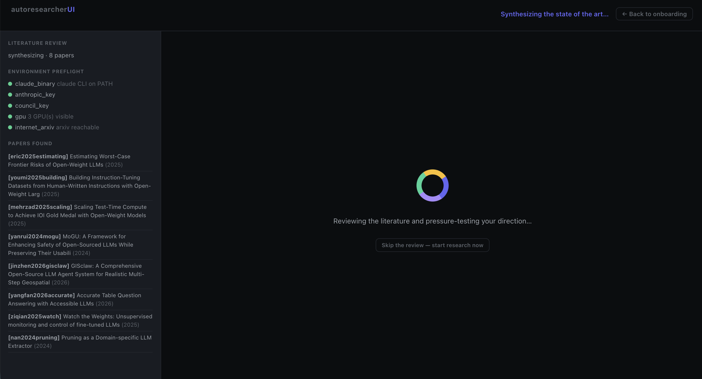
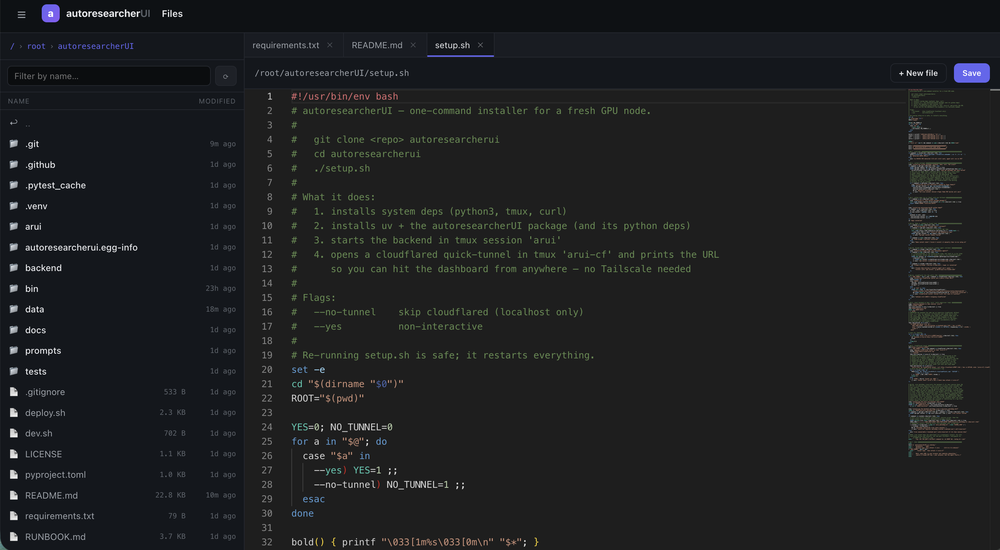

# autoresearcherUI

**`v0.1.0`** &nbsp;·&nbsp; **MIT** &nbsp;·&nbsp; **self-hosted** &nbsp;·&nbsp; **bring your own GPU**

> **AutoresearcherUI = Autoresearcher + wandb + datadog + overleaf + iTerm + claude code. All local and all free! Just boot up a node, git clone, bash setup.sh, fill out the onboarding form and let it research rip! Login to the research cockpit URL anywhere on earth.**

AutoresearcherUI is an open-source, single-binary cockpit that makes you the PI with as many autonomous researchers as you want writing papers for you. 

Basic AutoresearcherUI flow per node:
1. Rent a GPU box
2. git clone
3. `bash setup.sh`
4. copy the URL
5. Open it and fill out the onboarding form (namely the research purpose and objective function)
6. **Scope the research before any GPU spins up.** On submit, a scoping agent runs a literature review (arXiv + Semantic Scholar), synthesizes the state of the art, and adversarially pressure-tests your direction — proposing novel, citation-grounded ideas each with a cheap kill test. You confirm or refine the plan in a modal (chat back-and-forth; the plan re-synthesizes itself). See [*Scoping gate*](#scoping-gate-phase-0--plan-before-you-compute) below.
7. Then the research agent is good to go! Leave it alone and let it hillclimb. It will create a fresh research repo, write the `train.py`, spin up a council of agents to review the code, do a baseline run, then try to beat it, maintain a priority queue of ideas, and runs them around the clock updating you via email and the live dashboard until you are ready for your research to stop exploring and start writing the paper. Then the researcher agent will hand off the control of the GPUs to an author agent to nail down and prove specific claims and auto-draft the LaTeX paper and do all required ablation runs to support the claims of the paper. More detail below.

---

## Quickstart

```bash
git clone https://github.com/Fchaubard/autoresearcherui
cd autoresearcherui && bash setup.sh
```

The full installer is one script that installs all system deps, Node.js, Claude Code, `uv`,
Python deps, auto-login to Claude Code from your api key, the backend in tmux, and a
cloudflared quick-tunnel so the dashboard is reachable from anywhere on
earth. You can specify a passcode as you need to lock down the node. 

Re-running `setup.sh` is safe; if `~/.claude/` already has credentials
the OAuth step is skipped. Re-runs restart everything else.

> **Important — set up email so you never lose the dashboard URL.** The
> cloudflared quick-tunnel URL is **not stable**: it can rotate whenever the
> tunnel reconnects or the backend restarts. When it changes, autoresearcherUI
> **emails you the new URL automatically** — but only if email is configured.
> Install your [Gmail app password](#getting-a-gmail-app-password) (or a Resend
> key) during onboarding so a rotated URL is always one email away. Without it,
> a rotation can leave you locked out until you SSH in to read the new URL.

## What you get

It's five tools collapsed into one self-hosted process. Bring your own GPU box;
none of these services need to be reachable, paid for, or signed up for.

| You used to need | autoresearcherUI gives you |
|---|---|
| **karpathy-style autoresearcher agent + iTerm + council** | Same `program.md` / `train.py` / `ideas.md` philosophy, plus a web terminal UI that allows you to control the node, a scheduler that keeps every GPU saturated, and a research journal that writes itself. We also have a council of agents (Gemini/GPT/Claude) to review work and improve code/ideas. |
| **wandb / neptune / mlflow** | for tracking and analysis. The `arui` SDK (drop-in `wandb`-compatible API) writing into local DuckDB, live charts with shared-hover, an Analysis tab with filters/eye-toggles, and a per-run drawer with full plots and logs. |
| **datadog / grafana** | Live per-GPU utilization and memory monitoring, run reconciler, system-stats block (disk / RAM / GPU) alerts in every email. |
| **overleaf** | Paper Mode: a real LaTeX repo under `paper/`, an Author Agent that takes runs that win and ablates them to see if they will scale, hardening claims, and integrates finished ablations into figures and sections. |
| **PI Agent / Council** | An hourly PI Agent that nags whichever one is active (research agent or author agent), and a Council (Gemini + GPT-5, Claude tiebreaker) to review all code and reviewing every kept run to generate lessons and next ideas to try. |

## Two modes

**Research Mode** is the default. You write a one paragraph purpose and you can seed a
few ideas. The Research Agent (Claude Code, autonomous, in a `tmux` session
called `agent`) edits karpathy's `train.py`, queues runs, extends `ideas.md`, and the
orchestrator fans them across your GPUs. The Council reviews all code and each kept
result and feeds "lessons learned" back into the ideas queue. The PI Agent
checks in hourly helping with: idle GPUs, diverging runs, off-track queues, it types
messages straight into the agent's tmux as if a real PI walked by. 

**Paper Mode** is for when you think you've found something worth publishing. Flip the
toggle in the *Write the paper* tab to switch agents. The Research Agent pauses research runs. The Author
Agent (Claude Code, in a `tmux` session called `author`) takes over for ablation: writes the paper, it owns
the ablation queue, picks the experiments that will fill the figures, watches
results stream in via `arui`, kills divergers, and integrates every finished
run into the LaTeX. You approve a small Decision Queue (claim wording,
baselines to add, related-work to cite). The Lit Agent pulls candidates from
arXiv + Semantic Scholar. Flip back to Research at any time.

## The agents

```
   onboarding submitted
            │
            ▼
   ┌──────────────────────────────────────────┐
   │   Scoping Agent   ·   Phase 0            │  BEFORE any GPU is spent.
   │   (server-side: Lit Agent + Council;    │  Literature review (arXiv + S2),
   │    model = your onboarding pick,         │  SOTA synthesis + adversarial
   │    Gemini by default)                    │  idea critique w/ cheap kill
   │                                          │  tests. You confirm/refine the
   └────────────────────┬─────────────────────┘  plan in a chat modal.
                        │ on Confirm: seed directives.jsonl + lessons.md, then start_real
                        ▼
                       ┌─────────────────────┐
                       │      PI Agent       │  every hour, nags whoever's active
                       └──────────┬──────────┘
                                  │ switches by mode
                  ┌───────────────┴───────────────┐
                  ▼                               ▼
   ┌──────────────────────────┐      ┌──────────────────────────┐
   │     Research Agent       │      │      Author Agent        │
   │     (Claude Code)        │      │      (Claude Code)       │
   │  directives.jsonl →      │      │  ablations + LaTeX +     │
   │  train.py → kill divergers│     │  figure integration      │
   └────────────┬─────────────┘      └────────────┬─────────────┘
                │ on every kept run               │ on every paper run finish
                ▼                                 ▼
   ┌──────────────────────────┐      ┌──────────────────────────┐
   │        Council           │      │      Paper Runner        │
   │  Gemini ↔ GPT-5 debate   │      │  bin-packs paper-mode    │
   │  + Claude tiebreaker     │      │  runs onto idle GPUs     │
   └──────────────────────────┘      └──────────────────────────┘
                                                  │
                                                  ▼
                                     ┌──────────────────────────┐
                                     │       Lit Agent          │
                                     │  arXiv + Semantic Scholar│
                                     │  → cite candidates       │
                                     └──────────────────────────┘
```

- **Scoping Agent (Phase 0)** — runs **before** the Research Agent, server-side
  (no tmux session of its own). On onboarding submit it drives the **Lit Agent**
  (arXiv + Semantic Scholar) and the **Council** — using the model you choose in
  onboarding (the *Scoping agent* dropdown, **Gemini by default**) — to review
  the literature, synthesize the state of the art, and adversarially
  pressure-test your direction, proposing novel ideas each with a cheap kill
  test. You confirm or refine the plan in a chat modal (it re-synthesizes itself
  as you push back). On **Confirm** it seeds the Research Agent's
  `directives.jsonl` queue, caches the review in `lessons.md` (reused at paper
  time), and *then* launches the Research Agent. On by default;
  `ARUI_SCOPING_GATE=0` skips it. Full detail in
  [Scoping gate](#scoping-gate-phase-0--plan-before-you-compute).
- **Research Agent** — Claude Code in `tmux:agent`. Owns `train.py` and works
  the **`directives.jsonl`** queue (seeded by the Scoping Agent, extended by the
  Council; `ideas.md` is its human-readable render of that queue). Edits the
  script, launches runs, kills divergers.
- **Author Agent** — Claude Code in `tmux:author`. Owns the ablation queue
  and the LaTeX. Each finished paper-mode run is integrated into figures and
  sections in real time via a tmux poke from `/api/track/finish`.
- **PI Agent** — hourly. Reads GPU saturation, the last ~12 runs, the agent's
  recent output, and the top of `ideas.md`; types short concrete nudges.
  Switches persona by mode.
- **The Council** — runs in three places. **(1)** Up front in the
  **scoping gate** (see below) to synthesize the SOTA and pressure-test the
  plan before any GPU runs. **(2)** Once at project start as the
  **code-bless gate**. **(3)** After every kept run (batched every N), Gemini
  and GPT-5 independently review then debate up to N rounds; consensus
  applies, deadlocks go to Claude. Every round is persisted on the run.
- **Lit Agent** — pulls candidates from arXiv + Semantic Scholar, ranks by
  relevance, files cite-candidate decisions. Runs both up front (the scoping
  gate's literature review, keyed off your purpose) and in paper mode (keyed
  off the paper's claims) — the up-front review is cached and reused.
- **Paper Runner** — daemon that reads paper-mode `Run` rows with
  `status='queued'`, resolves deps, bin-packs onto the GPU table, launches
  them. Local backend in v0.1.0; SLURM/K8s pluggable later.

## Scoping gate (Phase 0) — plan before you compute

**Before the research agent ever spawns, you and a scoping agent agree on a
literature-grounded, novelty-checked plan.** This is on by default (set
`ARUI_SCOPING_GATE=0` to skip it). It exists to stop "research theater" —
burning GPUs on a direction that's already been done or won't beat the state
of the art.

When you submit onboarding:

```
backend: instead of spawning the research agent, starts a scoping phase
Lit Agent: sweeps arXiv + Semantic Scholar off your PURPOSE + seed ideas,
           caching PaperCitation rows (reused later at paper time)
Council:   the scoping model (your onboarding dropdown; Gemini by default)
           synthesizes the SOTA and adversarially assesses the direction —
           an honest read on each of YOUR seed ideas + new orthogonal ideas,
           every one carrying its closest prior work (cited by key, validated
           against what was actually retrieved — no hallucinated citations)
           and a cheap kill test (a <~1 GPU-hour experiment that would
           falsify it fast)
you:       review it in a full-screen modal — papers + preflight on the left,
           the plan in the center, a back-and-forth chat on the right, and an
           editable "confirmed research direction" + Confirm at the bottom.
           Push back in the chat; the plan re-synthesizes itself after each
           message (no button).
```

On **Confirm**, the gate materializes the plan into the existing autoresearcher
artifacts and *then* launches the research agent:

1. the ideas you kept become the agent's starting **`directives.jsonl`** queue;
2. the literature review is written to **`lessons.md`** (+ citations) and a
   `scope_brief` is injected into the agent's setup prompt, so it starts
   grounded and the Author Agent reuses the review at paper time instead of
   redoing the search;
3. `start_real()` spawns the Research Agent, which scaffolds
   `program.md` / `train.py` / `ideas.md`, runs your baseline, and works the
   seeded queue — exactly the normal flow, just no longer guessing from a raw
   prompt.

Escape hatches in the modal: **Skip the review** (start immediately from the
raw onboarding brief) and **Back to onboarding** (edit the form — it's restored
exactly as you left it). An in-progress scope also resumes if you reload the
page. The scoping model is chosen in onboarding (*Scoping agent* dropdown,
Gemini default — it's fast, which matters because the plan re-synthesizes after
every chat message).



## The default safety pattern: council code-bless

**No training runs launch until the council has reviewed and approved
the codebase.** This is the default behaviour, on by default, and you
cannot turn it off through the UI. It's the most important guardrail
to make sure the original code is functioning properly and avoids hallucinations.

Every time the Research Agent (re)spawns a new project:

```
agent: scaffolds program.md, train.py, prepare.py, ideas.md
agent: (recommended) launches a _probe or _smoke run that bypasses the
       gate, to confirm the script actually imports + does one optimiser
       step before wasting council tokens
agent: POST /api/council/bless
backend: reads every .py / .md / .yaml / .json / .sh in the workspace
         (skipping caches, datasets, checkpoints, .venv)
         and sends it to every available reviewer (Gemini, OpenAI) in
         parallel with a strict "find BLOCKERS not style nits" prompt
reviewers: return {approved, blockers:[...], suggestions:[...]}
backend: ALL reviewers must approve. Verdict persisted to Setting
         `code_bless` and broadcast on SSE.
agent: polls GET /api/council/bless/status every ~10 s
   - "pending"   → keep waiting
   - "approved"  → launch the baseline
   - "rejected"  → reads the `blockers` list, fixes the code, then
                   POST /api/council/bless again
```

Server-side enforcement: `POST /api/track/run` returns
**HTTP 423 Locked** unless `code_blessed=true`. The agent's `arui.init()`
call fails immediately, the agent reads the JSON body's `bless_status`
field, and knows exactly what to fix. (Run names starting with `_probe`
or `_smoke` bypass the gate so the agent can sanity-check the script
imports BEFORE submitting for review.)

The council's brief, paraphrased: catch BLOCKERS, not style nits. Real
blockers it looks for: `arui.summary["__METRIC__"]` misspelled or
missing; metric direction mismatch (logging loss while the project says
"maximize"); training set leaks into the eval set; baseline doesn't
match `program.md`; script crashes on import; never calls `.backward()`;
off-by-ones in epoch/step counting; dataset path that doesn't exist on
this node. What it explicitly DOESN'T flag: style, hyperparameter
choices, "consider also trying X".

You see the verdict live on the dashboard:

| State | Banner |
|---|---|
| `approved` | small green ✓ **code blessed** notification in the header |
| `pending` | violet banner: *"Council is reviewing the codebase…"* |
| `rejected` | red banner listing every blocker as bullets + *Clear & await re-review* button |
| `not_requested` | grey *"Awaiting code review"* note |

If you have no OpenAI or Gemini key configured, the bless auto-approves
with an honest "no reviewers configured, auto-approved" note. So you
can still run autoresearcherUI Claude-only; you just don't get the
code-bless protection on the baseline.

Want to force a re-review (e.g., the agent fixed something the council
flagged)? Hit **Clear & await re-review** on the banner, or
`POST /api/council/bless/reset`, the next run attempt will trigger a
fresh review.

## Screens

**Onboarding & Settings** — one form is the entire config surface. Email
for alerts, optional GitHub creds for repo sync, optional Claude / Gemini /
OpenAI tokens (Claude unlocks the agents; Gemini + OpenAI unlock the
council), the *Scoping agent* model dropdown (Gemini default), the project's
research question, seed ideas, validation metric, baseline, the
dangerously-skip-permissions toggle, and the agent's raw `program.md`.
Everything is editable later from the Settings modal.


**Dashboard** — the live cockpit. Headline metric vs. baseline plotted
across every experiment ever run, a per-GPU heat strip up top, the
running-best vs. baseline summary cards, a sortable / filterable table of
all runs, and the right-rail Research Agent terminal so you can see what
Claude is actually thinking. The amber banner is fired when the research
agent is intentionally paused (paper mode).


**Analysis** — W&B-style multi-run charts. Eye-toggle column to control
which runs are drawn, filter modal (status / metric / config), shared-hover
across every panel, two-way row↔line hover, smoothing slider, log toggle,
and expand-any-panel-to-full-pane. Click a row to open the per-run drawer
with every plot, the raw logs, and the council's review.


**Lessons learned** — auto-written by the Council after each strategic
review. Every entry summarizes a batch of runs ("twelfth batch in a row
repeats the same y=5 bf16 diffusion jobs…"), names what to do next, and
links the run ids it's reasoning over. The Research Agent reads these on
every tick. It's how the system avoids re-trying ideas that already
failed.


**Sessions** — live tmux output for any training run, the research agent,
or the author agent. Useful for the times when a specific run is
misbehaving and you want raw stdout/stderr instead of the aggregated
metric view.


**Files** — a JupyterLab-style file browser + code editor (Monaco, the VS Code
engine) over the agent's workspace. Browse the whole tree, open files with
syntax highlighting, edit and save (Ctrl/Cmd-S), create new files, and open
several at once as tabs that you can switch between — open tabs survive both
in-app navigation and a full page reload. Handy for peeking at or hand-fixing
`train.py` / `program.md` / `directives.jsonl` without SSH.



**Write the paper (Paper Mode)** — flip the toggle and the Research Agent
pauses, the Author Agent starts. Live LaTeX PDF preview on the left,
sub-tabs across the bottom (Today, Claim Coverage, Paper Plan, Critical
Path, Related Work, Versions, Rebuttal, Share), and the Author Agent
terminal on the right showing it integrating finished ablations into the
draft in real time.


**Read-only share link** at `/p/<token>` — mint it from the Share tab,
send it to a co-author. They see the latest PDF, the claims (with
evidence-strength chips), and the section-status pills: no login, no
write access, no risk of someone editing your in-flight LaTeX.


**System Stats** — per-GPU utilization + VRAM + temperature, host CPU /
RAM / disk-free, API latency. Two **Maintenance** buttons that have saved
my pod twice this week: *Purge old run logs* (configurable age + bottom-%)
and *Keep SOTA only* (aggressive: drops every checkpoint except the
project-best run).


**Research-mode email digest** — hourly by default (configurable
`immediate` / `1h` / `4h` / `12h` / `24h` / `off`). Headline progress
chart, what beat baseline, what's training now with ETAs, what's next on
deck. The "node health" block at the bottom (not shown here) shows disk
and RAM with a warning chip if anything is low.


**Paper-mode email digest** — daily. Different content: claims completed,
days to deadline, decisions waiting on you, citations the Lit Agent
pulled, ablations finished and integrated, author-agent commits. The
forward-to-co-author button drops them straight onto the read-only share
view.


## Emails

- **Research Mode** — hourly digest by default (configurable: `immediate` /
  `1h` / `4h` / `12h` / `24h` / `off`). `immediate` sends the moment a run
  beats the project's best metric.
- **Paper Mode** — daily 9-section digest: progress, claims coverage,
  decisions waiting on you, recent ablations, figure integration status,
  related-work additions, the council's latest take, system-stats, and a
  read-only co-author share link.
- Delivery auto-detects: Resend if a key is present, otherwise SMTP (Gmail
  app-password works out of the box).
- **Tunnel URL rotation** — if the cloudflared URL changes (tunnel reconnect or
  backend restart), you get an email with the new link. This is the main reason
  to configure email before you walk away from the node: it is how you get back
  in after a rotation.

### Getting a Gmail app password

If you want emails, you need to set `EMAIL` to a Gmail address during onboarding, you need an **app password** from
`GMAIL_APP_PW` (your normal login won't work — Google blocks SMTP for it).

1. Turn on **2-Step Verification** at
   [myaccount.google.com/security](https://myaccount.google.com/security).
   This is required; app passwords don't exist without it.
2. Open [myaccount.google.com/apppasswords](https://myaccount.google.com/apppasswords).
3. Type `autoresearcherUI` (or anything) in the "App name" box and click
   **Create**.
4. Google shows a 16-character code formatted like `abcd efgh ijkl mnop`.
   **Strip the spaces** and paste it into `GMAIL_APP_PW=` during onboarding.

If you don't see an "App passwords" page at all, 2-Step Verification isn't
on yet. 

## Configuration

All config lives in the onboarding form and then the settings tab: project purpose, validation metric,
optional API keys (Gemini, OpenAI, Anthropic), passcode gate, email recipients,
digest cadence, extra GPU nodes (SSH paste-in), and the raw `program.md` for
hand-tuning the agent's setup prompt. 

## Disk maintenance

Pods fill up fast with checkpoints and logs (we recommend at least 1TB on the node for this reason) — tmux scrollback and checkpoints. Two one-click cleanups
in System Stats if you need:

- **Purge old run logs** — drops stdout/stderr files of bottom-half runs older
  than N days. Run rows, metrics, reviews stay. Frees GBs in seconds.
- **Keep SOTA only** — walks each run's checkpoint folder and deletes
  everything that isn't the SOTA for that run.

A disk warning auto-appears in both email digests when free space is low.

## Telemetry

autoresearcherUI collects anonymous usage telemetry to understand which
features are used. It uses raw PostHog HTTP capture (no SDK, no autocapture,
no session replay, no cookies, no `identify()`, no PII). Each browser mints a
**random anonymous id** stored in `localStorage` and reuses it, so PostHog's
standard dashboards (daily/weekly active users, retention) work — that id is
just a random UUID with no name, email, or personal data attached. Server-side
events carry no browser id and never create a person profile.

We collect:

- event name — browser `$pageview` (with current URL/path) + a custom
  `page_view` (the app's view id), plus `app_started`, `app_loaded`,
  `paper_mode_entered`, `onboarding_completed`
- a per-browser random anonymous id (no PII)
- app version
- OS / platform / arch
- Python runtime version
- success/failure status and a coarse anonymous `error_type`

We do **not** collect:

- source code, prompts, file contents, or file paths
- repo names, usernames, emails, or hostnames
- environment variables, API keys, or tokens
- stack traces or any other PII

Disable telemetry with any of:

```bash
ARUI_TELEMETRY_DISABLED=1
DO_NOT_TRACK=1
CI=true
```

(`CI=true` opts out automatically.) See `backend/app/telemetry.py`.

## Architecture

One FastAPI process (`backend/main.py`) serves REST, SSE, the `arui` ingest,
and the static dashboard (vanilla JS, no build step). Metrics in **DuckDB**
(`data/metrics.duckdb`), metadata in **SQLite** (`data/autoresearch.db`). The
orchestrator launches `train.py` subprocesses against a GPU-slot scheduler.
Agents run as **tmux** sessions (`agent`, `author`) — observable, killable,
attachable. Background services: `monitor` (GPU telemetry + reconciliation),
`pi` (hourly oversight), `paper_runner`, `paper_watcher`, `notify`. The
**scoping gate** (`scoping.py` + `/api/scope/*`) is server-side and runs the
Lit Agent + Council before `start_real()`; it needs no tmux session. The
**Files** tab is backed by a small read/write file API (`/api/files/*`) and the
Monaco editor loaded from CDN.

## Hacking

```bash
bash dev.sh                            # local dev server
pytest tests/unit/                     # unit tests
python tests/e2e_test.py               # full e2e (hardware-free, ~20s)
bash tests/run_e2e.sh                  # the merge gate
```

Source layout: `backend/app/` is where everything lives. `api.py` is the route
surface. `orchestrator.py` is the research loop. `agent.py` has the
`FakeAgent` / `RealAgent` split. `scoping.py` is the Phase-0 scoping gate
(it drives `lit_agent.py` + the `scope_*` functions in `council.py`).
`paper.py`, `author_agent.py`, `paper_runner.py`, `paper_watcher.py`,
`paper_compile.py`, `lit_agent.py` are paper mode. `council.py`, `pi.py`,
`monitor.py`, `notify.py`, `maintenance.py` are the support services.
`arui/` is the tracker SDK.

## License

MIT — see [LICENSE](LICENSE).

## Credits

Karpathy's `zero_order_diffusion_autoresearcher` (the `program.md` / `train.py` /
`ideas.md` philosophy), Anthropic's Claude Code (the agents), FastAPI, DuckDB,
uv, cloudflared (the boring magic).
