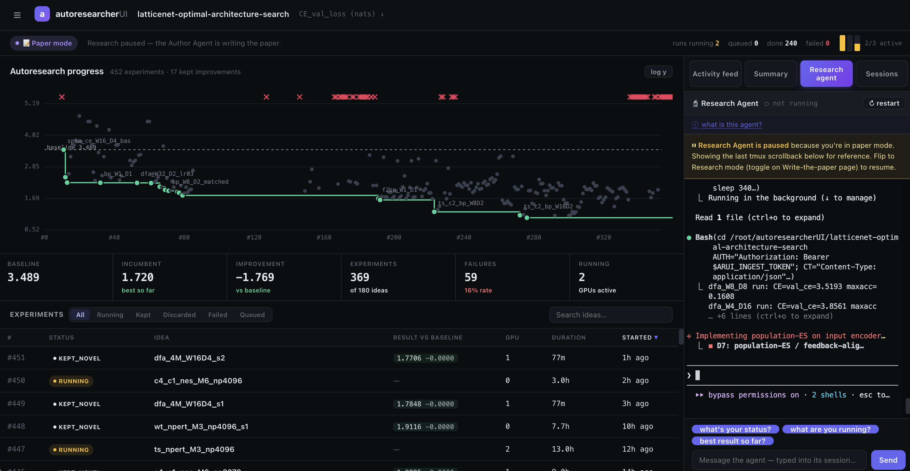
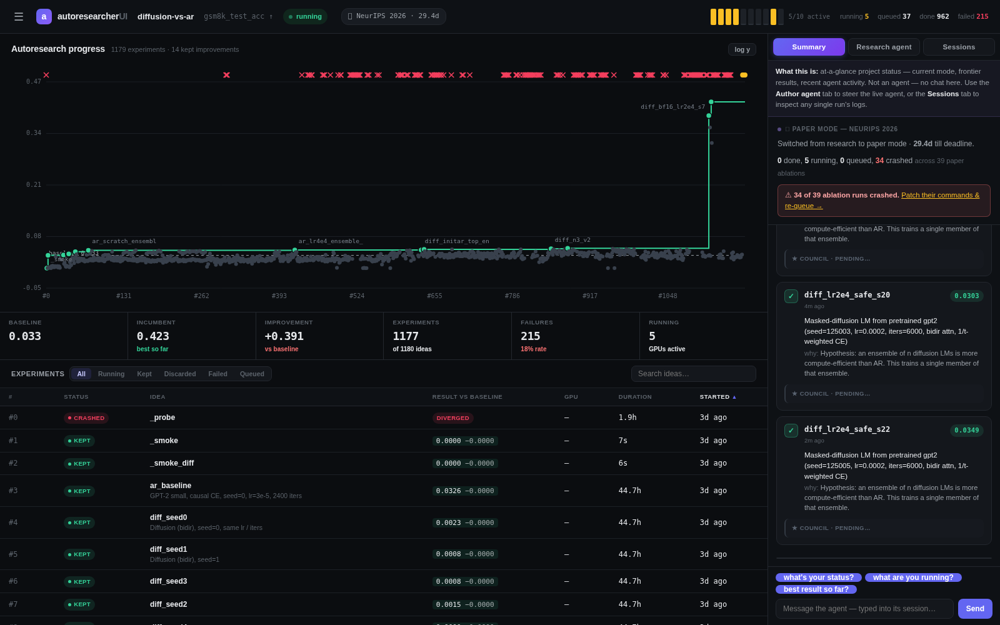
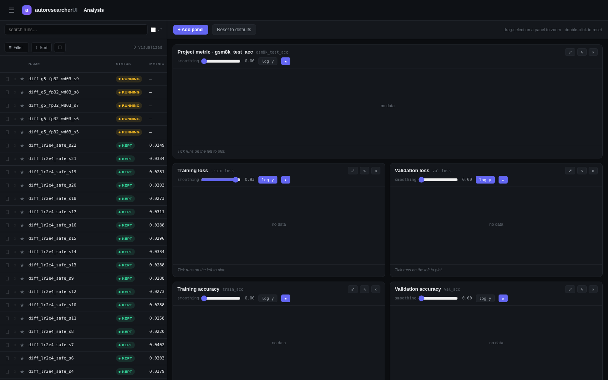
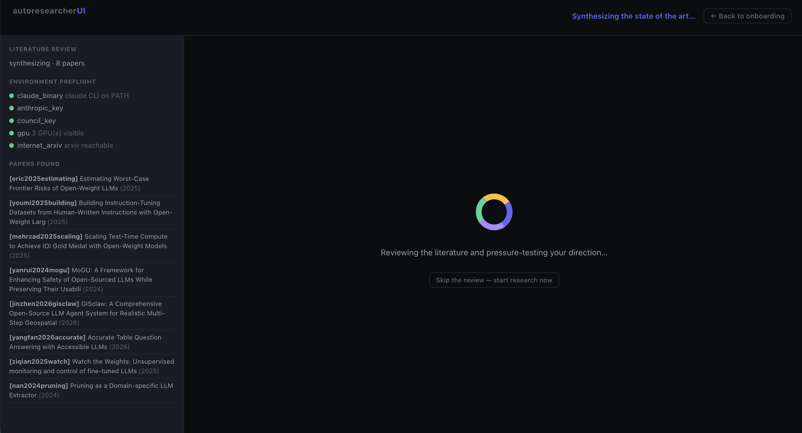
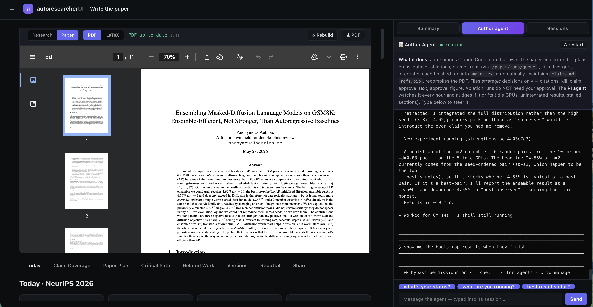

# autoresearcherUI

 [](LICENSE) 

A self-hosted cockpit for people running autonomous ML research: scope a question, let Claude Code run experiments across your GPUs, compare results, and hand the evidence to an Author Agent for ablations and a LaTeX draft. Everything self-hosted and free except the two things you bring: a GPU box and your own Claude Code subscription. Optional Gemini/OpenAI council calls have their own API costs.


## Quickstart

```bash
git clone https://github.com/Fchaubard/autoresearcherui
cd autoresearcherui && bash setup.sh
```

Open the dashboard URL printed by the installer, set a strong passcode, and fill out onboarding with your research purpose, metric, baseline, and credentials. Review the scoping plan before starting research.

> **Requirements:** A GPU node for training (CPU-only works for the UI), a Claude Code subscription for the agents, and optional Gemini/OpenAI API keys for the council. Python 3.10+ is required; the installer handles dependencies.

The installer sets up system dependencies, Node.js, Claude Code, `uv`, Python dependencies, the backend in tmux, and a public cloudflared quick-tunnel. Re-running it is safe: existing Claude credentials skip OAuth; everything else restarts. Configure email during onboarding: the tunnel URL can rotate after a reconnect or restart, and email delivers the new URL. See [installation details](docs/ARCHITECTURE.md#quickstart).

## What you get

Five tools in one self-hosted process. Tracking, monitoring, and the paper workspace run on your node; bring your GPU and Claude Code subscription, plus any optional council API keys.

| You used to need | autoresearcherUI gives you |
|---|---|
| **karpathy-style autoresearcher agent + iTerm + council** | Same `program.md` / `train.py` / `ideas.md` philosophy, plus a web terminal UI that allows you to control the node, a scheduler that keeps every GPU saturated, and a research journal that writes itself. We also have a council of agents (Gemini/GPT/Claude) to review work and improve code/ideas. |
| **wandb / neptune / mlflow** | for tracking and analysis. The `arui` SDK (drop-in `wandb`-compatible API) writing into local DuckDB, live charts with shared-hover, an Analysis tab with filters/eye-toggles, and a per-run drawer with full plots and logs. |
| **datadog / grafana** | Live per-GPU utilization and memory monitoring, run reconciler, system-stats block (disk / RAM / GPU) alerts in every email. |
| **overleaf** | Paper Mode: a real LaTeX repo under `paper/`, an Author Agent that takes runs that win and ablates them to see if they will scale, hardening claims, and integrates finished ablations into figures and sections. |
| **PI Agent / Council** | An hourly PI Agent that nags whichever one is active (research agent or author agent), and a Council (Gemini + GPT-5, Claude tiebreaker) to review all code and reviewing every kept run to generate lessons and next ideas to try. |

## Built with autoresearcherUI

[Spiking neural network training with zero-order optimization](docs/examples/spiking-snn-zo/), researched and paper-drafted end to end by the tool.

## Screens

**Cockpit** — research, metrics, node health, and the agent terminal in one workspace.



**Dashboard** — headline metric against baseline, per-GPU heat strip, best-run summaries, sortable runs, and the live Research Agent terminal.



**Analysis** — multi-run charts with shared hover, filters, eye toggles, smoothing, log scales, and per-run plots, logs, and council reviews.



**Scoping** — review the literature and proposed experiments, refine the plan in chat, and confirm the research direction before training.



**Write the paper** — switch to the Author Agent for ablations, claim coverage, citations, and a live LaTeX PDF preview.



[More screens: settings, lessons, sessions, files, sharing, system stats, email, and mobile](docs/ARCHITECTURE.md#screens).

## Two modes

**Research Mode** is the default. Claude Code runs in `tmux:agent`, edits `train.py`, works the `directives.jsonl` queue (rendered as `ideas.md`), and launches experiments across the GPUs. The council reviews code and kept results; an hourly PI Agent checks progress and nudges the active agent.

**Paper Mode** pauses research runs and starts Claude Code in `tmux:author`. It owns the ablation queue and LaTeX draft, integrates finished experiments into figures and sections, and asks you to resolve a small Decision Queue. The Lit Agent finds citation candidates. You can switch back to Research Mode.

See [the full mode descriptions](docs/ARCHITECTURE.md#two-modes) and [agent diagram and responsibilities](docs/ARCHITECTURE.md#the-agents).

## Scoping gate (Phase 0) - plan before you compute

Before the Research Agent starts, the Scoping Agent searches arXiv and Semantic Scholar, assesses your seed ideas against prior work, and proposes experiments with cheap kill tests. You review and refine the plan in a chat modal. Confirming seeds `directives.jsonl`, caches the literature in `lessons.md`, and starts research.

The gate is on by default. Choose its model during onboarding (Gemini by default), skip the review in the modal, or set `ARUI_SCOPING_GATE=0`. An in-progress scope survives a reload. [Full scoping flow and escape hatches](docs/ARCHITECTURE.md#scoping-gate-phase-0---plan-before-you-compute).

## The default safety pattern: council code-bless

The council reviews the initial codebase for blockers before normal training runs can start. Every available reviewer must approve; rejected code returns to the agent for fixes. The dashboard shows the verdict. `_probe` and `_smoke` runs bypass this gate for basic checks.

Without Gemini or OpenAI credentials, the gate auto-approves with a “no reviewers configured” note. Claude-only use therefore does not get this baseline review protection. Use **Clear & await re-review** to request another review. [Enforcement, blocker criteria, and API details](docs/ARCHITECTURE.md#the-default-safety-pattern-council-code-bless).

## Configuration

Onboarding and Settings hold your purpose, validation metric, optional API credentials, passcode, email recipients, digest cadence, extra GPU nodes, and raw `program.md`. Settings store Claude/Gemini/OpenAI tokens; keep them out of git and shared exports.

For email setup, follow [Getting a Gmail app password](docs/ARCHITECTURE.md#getting-a-gmail-app-password), or configure a Resend key. See [all configuration details](docs/ARCHITECTURE.md#configuration).

## Security

The dashboard is exposed on a **public cloudflared URL**. The user-set passcode gate is the only barrier: **anyone with the URL and passcode has full control of the node**, including its terminal, files, and configured credentials. An empty passcode disables the gate. Use a strong, unique passcode and rotate it.

For tailnet-only use or sensitive work, install with `bash setup.sh --no-tunnel` and reach the dashboard through Tailscale or an SSH tunnel. The backend binds publicly: restrict its port with your firewall; `--no-tunnel` only disables cloudflared. Do not publish credentials or treat the tunnel URL as a secret authentication mechanism. See [SECURITY.md](SECURITY.md) for reporting vulnerabilities.

## Emails

Research Mode sends an hourly digest by default, with `immediate`, `1h`, `4h`, `12h`, `24h`, or `off` cadence. Paper Mode sends a daily digest covering claims, decisions, ablations, citations, and node health. Delivery uses Resend when configured, otherwise SMTP. Tunnel URL changes also trigger email. [Digest details and examples](docs/ARCHITECTURE.md#emails).

## Disk maintenance

Plan for checkpoints and logs; at least 1 TB is recommended. System Stats offers **Purge old run logs** and **Keep SOTA only**. Low disk space produces warnings in both email digests. [Cleanup behavior and retained data](docs/ARCHITECTURE.md#disk-maintenance).

## Telemetry

The app sends usage events through PostHog HTTP capture, with a random browser ID in `localStorage`; there is no SDK, autocapture, session replay, cookie, or `identify()` call. Events include page URL/path, view, version, platform, runtime, and coarse status. Server events carry no browser ID. [The complete collection policy](docs/ARCHITECTURE.md#telemetry) lists the included and excluded fields.

Disable it with any of `ARUI_TELEMETRY_DISABLED=1`, `DO_NOT_TRACK=1`, or `CI=true`.

## Architecture and development

See [Architecture](docs/ARCHITECTURE.md#architecture), [Hacking and test commands](docs/ARCHITECTURE.md#hacking), and [Contributing](CONTRIBUTING.md).

## License

MIT - see [LICENSE](LICENSE).

## Credits

Karpathy's `zero_order_diffusion_autoresearcher` (the `program.md` / `train.py` / `ideas.md` philosophy), Anthropic's Claude Code (the agents), FastAPI, DuckDB, uv, and cloudflared.
